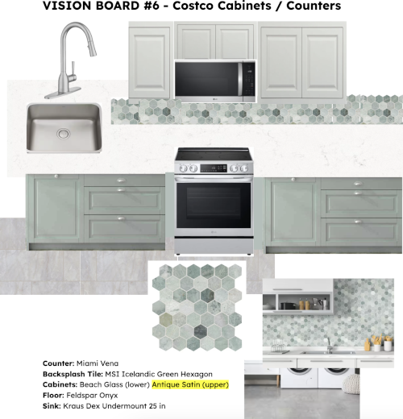
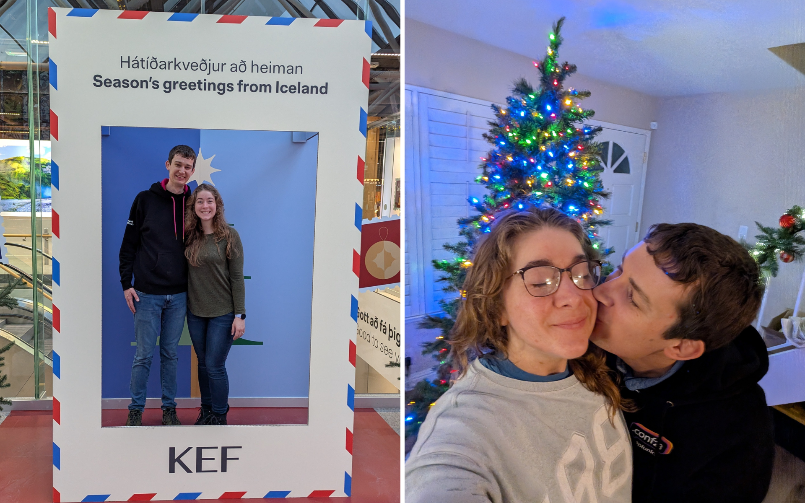

---

layout: default

title: "Christmas Letter 2025"

---
# Merry Christmas!

2025 was such a FULL year! So much happened, in fact, that we are not even going to attempt to summarize the year chronologically. Instead, as an introduction to our 2025 letter, we have crafted a year in review that was inspired by our card design and is, loosely, set to the tune of “12 Days of Christmas." 

**Rae and Landon’s Twelve Months of 2025**

In the twelve months of 2025, 
My true love enjoyed with me:

TWELVE months of Landon’s freshly baked bread  
ELEVEN-ish barre classes Rae taught each month  
TEN great trips and visits from our family and best friends  
  (especially this summer,  
  when you could find us in  
  San Diego, Irvine, Bar Harbor, Lynden, and Seattle)  
NINE-ty year celebrations  
EIGHT batches of homemade yogurt  
SEVEN Gernants/Sterks in Chicago  
(where we enjoyed Cubs games, Wait, Wait Don’t Tell Me live, and Kyra & Alec’s wedding)  
SIX live plays or musicals  
FIVE times ten books and counting  
(but more if you count Landon’s)  
FIVE years of marriage  
FIVE years in our condo  
FOUR new countries visited  
Except only THREE for Landon  
  (because he pointed out he’s already been to Austria)  
TWO 30th birthdays  
and A lovely, long-awaited kitchen renovation   
  *\*insert piano flourish and final cord here\**

In the rest of our letter, you can read all about our two international trips, kitchen renovation, and Rae’s book recommendations. We also have a “Year in Pictures” section at the end as a reward for reading the whole letter (just kidding, feel free to skip to it!). As for all the other fun alluded to above, we’d love to catch up if you want the full scoop for everything we did.

<a href="#year-in-pictures" class="jump-button">📷 Jump to our Year in Pictures 🖼️</a>

## European Cities Trip
Our first big trip of the year was a Spring Break tour in Europe, with stops in Amsterdam, Prague and Vienna. Last Christmas, we pitched the idea to Rae's family, and her parents joined us for the trek! We met up in Amsterdam, where we enjoyed walks along canals and cobblestone streets, visits to art museums, and a glorious performance of St Matthew's Passion the night before Easter. We also enjoyed a fabulous walk through the Keukenhof tulip garden, where we accomplished Rae's dream of seeing spring tulips in bloom. Landon was enthused to visit Delft, a city known for manufacturing blue and white porcelain, so we finally have some Dutch-style pottery in our house.

<!-- Carousel: Amsterdam -->


Next, we flew to Prague to visit Lukas, who lived with the Gernant family in Iowa for a year during Rae's first year in college. Lukas showed us some of his favorite spots in the city and brought us to see postcard-worthy spots both on the tourist lists and local secrets. It was an incredible treat to have an architecture and urban planning expert as our guide to the city. We had so much fun with Lukas, and learned so much about Czech history and the fascinating stories of Prague's evolution over time.

<!-- <photos from Prague> -->


We said goodbye to Lukas and Prague, and took a cozy train ride to Vienna through the beautiful Czech and Austrian countryside. Vienna's old city was charming, with cozy cafes for coffee and a towering cathedral over it all. Rainy weather sent us inside for most of the time, but we explored the Schӧnbrunn palace and took a self-guided street car tour of the city center! Food was the wurst (!) part - traditional Austrian fair offered many cozy dishes for the cold weather, and warm Apfelstrudel was an easy hit. On our last night in Europe, Landon and Rae attended a performance of Mozart's Magic Flute opera at the historic Vienna State Opera House; the only tickets available were in the standing-room "stehplatze", but seeing the inside of the opera house alone made standing all night worth it! Although we were exhausted by the finale, it was the perfect end to a whirlwind tour of April in Europe.

<!-- <photos from Vienna> -->


## Kitchen Renovation

In the summer, we checked off a very notable achievement: we renovated our kitchen! Considering how much time we spend cooking and baking, this was a long-awaited upgrade to our condo that has brought us much joy since its completion. Rae spent a lot of time early this year vision-boarding and she has a 30 page Google Doc to show for it. In the end, our finished kitchen isn’t too far off from the version of cobbled together screenshots.

In the 5 years we lived in this condo, we’ve already had to replace the dishwasher and stove, so it was just the microwave that wasn’t stainless steel. The project was then refinishing our cabinets, replacing the grout-and-tile countertops with smooth quartz, and replacing the flooring.

<!-- whole process carousel -->

Landon started off the flooring renovation as a DIY job, but he quickly realized that he was out of his league and handed off the rest of the installation to professionals. We ended up getting the floor levelled as a result, which was an added perk.

Despite some delays along the way, we're really happy with our new space, which has made cooking and cleaning up more enjoyable.

<!-- Need to add photo from now - clean the kitchen! -->
## Iceland Trip
In addition to seeing the tulips at Keukenhoff, Rae has dreamed of getting to see the Northern Lights. Once again having the week of Thanksgiving off for Rae’s work, we planned a trip to Iceland. Although it would be a quick trip to also try and make it home for Thanksgiving day, Iceland offered the perfect mix of moderate winter weather and relaxing activities to fill the short winter days. 

On the first two nights, we had beautiful, starry, clear skies but no Northern Lights. We tried not to be too disappointed and crossed our fingers for the rest of our stay. On the third night, Landon woke Rae up around 1am and we shivered on the deck getting some nice pictures. We couldn’t see the lights with our eyes, but they were there! On our final night, the skies were cloudy and a multi-day snow storm had started. But around 3am, Landon woke up and saw the lights actually dancing across the sky before they hid back behind the clouds.

<video width="640" height="480" src="assets/img/iceland/aurora_video.mp4" frameborder="0" allowfullscreen autoplay controls loop></video>

Besides watching the auroras dance above our cabin, the highlights of our trip were:



Exploring ice caves on a glacier (Katla Geopark / Mýrdalsjökull glacier)


Going to a geothermal lagoon spa with a beautiful, sunset view 


Seeing majestic Icelandic waterfalls and geysers (Gullfoss / Geysir)



Exploring Icelandic cuisine (including a food tour walk in Reykjavik)

## Book Recommendations

### Rae’s Top 3(ish) 
- **_There Are Rivers in the Sky_ by Elif Shafak - Fiction**  
If you take none of my other recommendations but you read this book I would be happy. This is arguably the best book I have read in 3 years. It is about water, which is to say it is about life. It is about being alone and being part of a bigger story. It is about religion, history, and the stories that get told. It is beautifully written and I wanted to start it again as soon as I finished it. (I never feel like that.) Go read it. 
- **_Interpreter of Maladies_ by Jhumpa Lahiri - Short Story Collection**  
This collection of intentionally-crafted stories might be the best I’ve read. I was impressed by the details in each story and the way “what happened” was told more through symbols and images than anything else. The ones I loved the most were: "A Temporary Matter," "A Real Durwan," and "The Third and Final Continent."
- **_The Anxious Generation_ by Jonathan Haidt - Non-fiction**  
This was big in 2024 when it came out, which is deserved. Everyone should read this. Mainly parents, educators, and everyone born after 1995. Our society has not been protecting kids online and not providing parents with needed support. I hope change comes quickly, but I appreciated that this book is not only identifying problems; Haidt has actual recommendations and advice, which I really appreciated. 
- **Honorable Mention #1: _Say You’ll Remember Me_ by Abby Jimenez - Romance**  
This book was so sweet and has so much going for it. Not least of which being that it gets Taylor Swift’s “Wildest Dreams” stuck in my head every time I see it. I liked that for this one it was always the situations and circumstances getting in their way. It felt different from romances where the problems involve seriously hurting each other, keeping secrets, or needing to work on themselves first. 
- **Honorable Mention #2: _Finding Grace_ by Loretta Rothschild - Fiction**  
Not a solid 5 star book, but an impressive debut novel that raises interesting ideas about motherhood, grief, and moving on. I went into it completely blind and I recommend it. The author’s poignant stylistic choices, especially the narrator, are the reason this book continues to rent space in my head. 

### Rae’s Fantasy Top 5 
As I tried to choose only my top 5 of the whole year, I realized that all the fantasy books below would be books #2-6. Since I wanted to mention more than just fantasy above, they got their own section :\)
- **_The Rhythm of War_ by Brandon Sanderson**  
You guys, this was the  t h i r d  time I started this book and I finally did it. It was also great. I really hesitated because I thought it would ruin my yearly book goal (and it only kind of did) but it was, in the end, worth it. I had a much better time here than book 3. I am so comfortable in this world and I need everyone else in my life to get in on this. 
- **_Our Infinite Fates_ by Laura Steven**  
Okay I loved reading this. It had that “all I want to do is read this book” energy I crave yet so rarely find. Time loop, curse, star-crossed lovers, *intrigue*... wow, for me, this book had it all. 
- **_Heir_ by Sabaa Tahir** (author of The Ember in the Ashes series)  
Oh my it felt so good to be reading Sabaa Tahir again. I truly do not know how she does it. Like Our Infinite Fates, this book was so fun to read. It’s set in the same world as the Ember quartet, which I read in 2022, and I’ve been searching for a fantasy series like it since. Reading Heir reminded me why nothing else has measured up. 
- **_Earthseed_ duology by Octavia Butler** (Parable of the Sower and Parable of the Talents)  
Considered a modern classic for a reason. I actually think everyone should read this series. And yes, I do think the second one is essential. After reading both, I cannot imagine only having read the first. 
- **_Starling House_ by Alix E. Harrow**  
Haunted houses and gothic stories are never my thing. BUT, this story, with its local legends and multi-generational injustices, was best told as a gothic, haunted house story. While not a “perfect” book, it gives the reader a lot to think about and lends itself well to discussion, making it a great book club book. 

## Year in Pictures

Merry Christmas from Landon and Rae! ❤️🎄

<!-- prime all of the swipers -->
